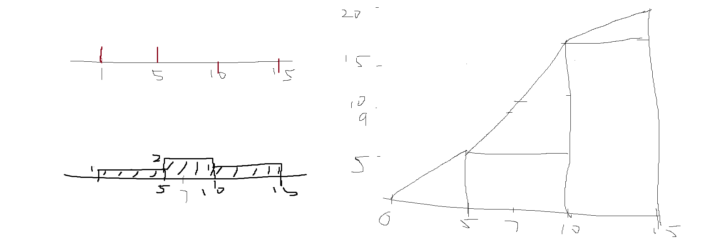

# 코드

    #include <string>
    #include <vector>
    using namespace std;
    int tti(string str){    
        int h = ((str[0]-'0')*10+(str[1]-'0'))*3600;
        int m = ((str[3]-'0')*10+(str[4]-'0'))*60;
        int s = (str[6]-'0')*10+(str[7]-'0');
        return h+m+s;
    }
    string itt(int t){
        string h = to_string(t/3600);
        if(h.length()==1) h="0"+h;
        string m = to_string((t%3600)/60);
        if(m.length()==1) m="0"+m;
        string s = to_string(t%60);
        if(s.length()==1) s="0"+s;
        return h+":"+m+":"+s;
    }
    int cal(pair<int,int>a,pair<int,int>b){
        if(a.first>b.second||b.first>a.second) return 0;
        return min(a.second,b.second)-max(a.first,b.first);
    }
    string solution(string play_time, string adv_time, vector<string> logs) {
        int max_S=tti(play_time)+1;    
        int pt=tti(play_time);
        int at=tti(adv_time);
        vector<long long>V(max_S);
        for(string log:logs){
            int st=tti(log.substr(0,log.find('-')));
            int ed=tti(log.substr(log.find('-')+1));
            V[st]++; V[ed]--;
        }   
        for(int i=1;i<max_S;i++) V[i]+=V[i-1];
        for(int i=1;i<max_S;i++) V[i]+=V[i-1];
        long long res=0;
        int ans=0;
        for(int i=0;i<max_S;i++){
            long long tp= V[i]-(i-at<0? 0:V[i-at]);
            if(tp<=res) continue;
            res=tp;
            ans=i-at+1;
        }
        if(ans<0)ans=0;
        return itt(ans);
    }

# 피드백

    누적합이라는 개념을 아예 몰랐었다.

    V[st]++; V[ed]--;
    for(int i=1;i<max_S;i++) V[i]+=V[i-1];
    for(int i=1;i<max_S;i++) V[i]+=V[i-1];
    두 식에 의해 해결되는데 적분 효과를 가진다.

